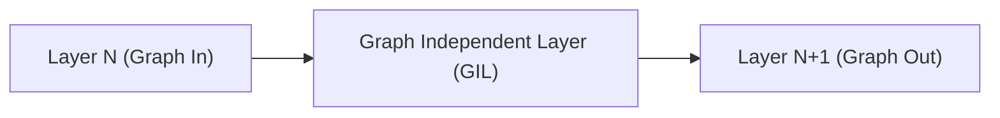
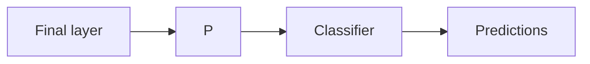

https://distill.pub/2021/gnn-intro/
https://arxiv.org/html/2410.17409v1 <- Research paper on GNNs for modelling human interactions in crowds

Graphs - Entities and relationships
Stanford CS224W notes in Graph ML
* Representation learning can be used to auto-learn features. Skip feature engineering
	* Map nodes to d-dim embeddings where similar nodes in the network are more closely embedded

Average degree
$$
\bar{k} = \frac{2E}{N}
$$
$E$ is the no. of edges and $N$ is the no. of nodes

Bipartite graphs - Two sets of nodes U and V. U interacts with V

| Class                        | Types                           |
| ---------------------------- | ------------------------------- |
| Traditional methods          | Graphlets, Graph Kernels        |
| Node embedding methods       | DeepWalk, Node2Vec              |
| GNNs                         | GCN, GraphSAGE, GAT, GNN Theory |
| Knowledge graphs & reasoning | TransE, BetaE                   |
| Deep generative graphs       |                                 |
| Applications                 |                                 |

- Useful in applications involving real-world entities that can be represented as graphs
	- Images 
	- Text
		- Typically, text is represented as a sequential graph, which is used in RNNs. However, in transformer models, text is often represented as a fully connected graph --> ==Graph Attention Networks== [[Attention Mechanism in LLMs]]
	- 3D molecules
	- Social networks
	- Citation networks 
	- Autonomous navigation on roads (Dataflow ML)
	- Math equations
- [The KONECT project](http://konect.cc/) is a catalog of all network datasets with extensive information 
- 3 types of predictions can be performed on graphs
	- Graph-level --> Predict properties of entire graph
		- Analogous to image classification and sentiment analysis. Label/assign property to entire entity
	- Edge-level --> Predict relationships between nodes in graph
		- Analogous to image scene understanding where relationships between segmented objects of images are discovered/predicted
	- Node-level --> Predict properties of nodes in the graph
		- Analogous to image segmentation and parts-of-speech word in a sentence
- [PyTorch-Geometric library](https://pytorch-geometric.readthedocs.io/en/latest/install/installation.html) and [NetworkX Library](https://networkx.org/)
- How do we form the input for DL models?
	- Node feature matrix N -> Each node i has a set of features. Can be processed easily but representing connectivity is difficult
	- Adjacency matrix -> Easily tensorizable but the connectivity can be highly variable, leading to very sparse adjacency matrices which are space-inefficient
		- Different matrices can encode the same connectivity -> no guarantee that these matrices will give the same result in a DNN. They aren't necessarily permutation invariant. Larger entities -> untenable number of matrices
		- Space-efficient method to store sparse matrices - Adjacency lists. These are permutation invariant
			- [x] Struggling to understand adjacency lists
- GNNs are optimizable transformations on all attribs of the graph. The input to a GNN is a graph loaded with features and the output of the GNN is also a graph. Graph symmetries are preserved as well as connectivities (Graph In Graph Out (GIGO))
	- Message passing NN framework is used (Gilmer et al)
	- Graph Nets archiecture (Battaglia et al)
Single layer of GNN. This is the simplest GNN at its core

The out-graph has the same adjacency list but updated embeddings
* Predictions can be made in the simplest sense by applying a linear classifier to the final layer to predict the nodes
* What if only edge information is available but node prediction is necessary? Use pooling (p)
	* Pooling gathers edge embeddings into matrices ("pools") and sums them. ==Similar to CNN pooling?==
	* The gathered embeddings are then aggregated by summing

* All node and edge embeddings can be aggregated to predict a binary global property of the graph. ==Similar to Global Average Pooling in CNNs==
* Message passing in pooling stage - Nodes/edges pass information to each other, updating their embeddings
	1. For each node, gather all neighboring node embeddings
	2. Aggregate (sum) the embeddings
	3. All pooled messages are passed to an update (NN) function
	* This is ==similar to convolution in CNNs. GNN -> element is node. CNN -> element is image pixel. Difference? Node can have variable connectivity but in images, pixel always has set no. of neighbouring pixels==
		* GCN (Graph Convolutional Network) --> Each layer passed through means that a node will have information of its 1st-degree neighbouring nodes incorporated in its embeddings. Second layer -> two degrees and so on
* Order of updating and choice of graph attributes to update is an open area of research
	* Weave method -- Node->Node + Edge->Edge + Node->Edge + Edge->Node
* Issue: Far-away nodes will struggle to pass embeddings efficiently. Solution: Use the global embedding/context itself, which is connected to all nodes and edges
* GNNs are highly parameter-efficient
* Higher no. of layers does not always increase GNN performance because in that case, the information sent across many nodes becomes diluted
* The more graph attributes communicating, the better the GNN

* Generative modelling of graphs using GNNs -> Drug development

- GNNs aren't in high demand currently because
	- They are useful and applied in biotech/drug R&D/neuroscience --> They are also useful in recommendation systems and autonomous driving
	- They aren't as highly versatile and performant as transformers
	- Most data is tabular
	- Not commonly taught
	- Expensive
	- Too complex and non-intuitive
		- Spatial locality isn't there with graphs as much as with images
		- Arbitrary size and topology. Can be easily complicated
		- No fixed node offering/reference
		- Often dynamic and multi-modal
